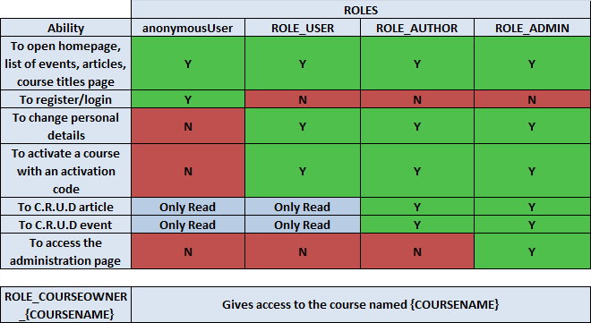

## MyColorOfLife

# Idea

The main idea is to create a website about psychology.

# MVP Scope

* As an unauthorized user, I want to be able to visit the public pages of a website
* As an authorized user, I want to be able to change my personal details and activate the course with an activation code that will be sent to my email
* As an author, I want to C.R.U.D my own events, articles
* As an admin, I want to C.R.U.D any events, articles and be able to visit the admin page.

# ROLES

# Technological stack

* spring-boot-starter-oauth2-client
* thymeleaf-extras-springsecurity5
* spring-boot-starter-thymeleaf
* spring-boot-starter-validation
* spring-boot-starter-data-jpa
* spring-boot-starter-security
* spring-boot-starter-tomcat
* spring-boot-starter-web
* spring-boot-starter-mail
* spring-boot-starter-test
* spring-boot-devtools
* spring-security-test
* fest-assert-core
* commons-text
* mockito-core
* flyway-core
* postgresql
* lombok
* Docker

# License

This project is **Apache License 2.0** - see
the [LICENSE](https://github.com/VladyslavBabenko/MyColorOfLife/blob/master/LICENSE) file for details